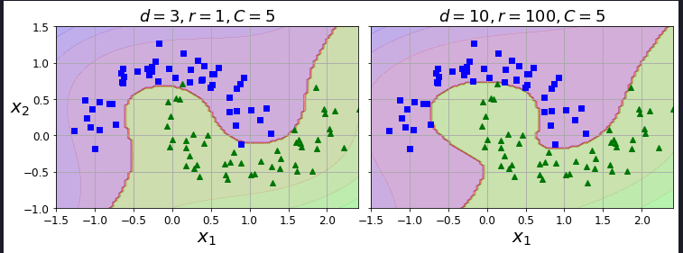
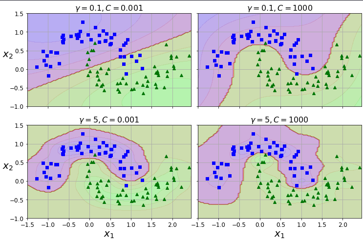
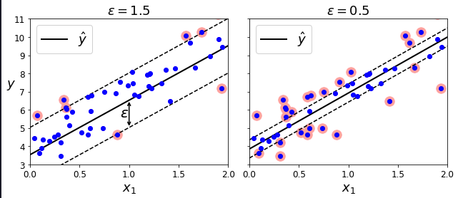

# Support Vector Machines (SVM)

## Overview

A support vector machine is an ML model primarily capable of performing classification on small to medium-sized datasets, though it can also perform regressions. It does not scale well with data size, however.

## Linear SVM Classification

How it does this:
- Takes the data to be classified
- Identifies the groups
- Finds the widest possible street between the classes, known as large margin classification
    - This means that, take the groups
    - Find the farthest possible point from the center of a cluster, and also make sure that point is closest towards the other group
    - Draw a line through it to separate this cluster from the others
    - Do this for each cluster until we get parallel lines that make the wide street
Check page 176 for a Figure 5-1, explains it well

## Soft Margin Classification

A hard margin classifier means that every data point within a cluster should lie on its appropriate side behind the margin, not on like earlier. This model is very inflexible, and it also leads to many issues such as dealing with outliers or non-linearly-separable data.

The objective is to find a good balance between keeping the street as large as possible and limiting the margin violations. This balance is called soft margin classification.

SVM classification will be a soft margin one. In order to do this, the model Scikit-Learn has includes a hyperparameter C (regularization). The larger the C, the lesser the violations will be and the 'harder' the margin will be.

Hence, we would have a large margin with a low C (wider street), but more violations. If model is underfitted, increase C to get a wider street. If model is overfitted, reduce C to allow for more violations and better accuracy.

Unlike Logistic Regression, Linear SVC does not have a 'predict probability' score. However, if we use the SVC class instead of Linear SVC, and if you set its probability hyperparameter to true, then the model will fit an extra model at the end of training to map those probabilities. But it does do this in a lengthy process of 5-fold validation and Logistic Regression, so considerably slower. But since Logistic Regression is run, all of its methods will be present.

## Nonlinear SVM Classification

But data is stupid. And often times, it just will not be linearly separable.

### Polynomial Features

To work around this, we often use polynomials to our advantage. A variable $x_1$ might just be a straight line of data, but if we make a second feature $x_2 = (x_1)^2$, then $x_2$ becomes a parabola with a very clean mid-part that can be linearly separable. To implement this idea, we often just create a pipeline that contains a `PolynomialFeatures` transformer, then followed by a `StandardScaler` and `LinearSVC` classifier. 

Now, polynomials work well with lots of different models, not just SVM. Problem is, a low polynomial degree runs the risk of not dealing with complex datasets, and high polynomial degree creates too many features, making the model slow.

Fortunately, when using SVMs you can apply a technique called the _kernel trick_. Essentially, you get the same result as if you performed a high-degree polynomial, but without actually adding them.

The book doesn't really explain how the kernel works, just that it does.

As you can see in the image, we may want to mess around with the degree based on how overfitted or underfitted the model is.

### Similarity Features

From what I understand, it is just making a function from the first features, and then using landmarks at each data point to get new datapoints that can be linearly separable. I feel like this would run the risk of greater overfitting for the similarity features, so I should keep that in mind if ever using this. Always shoot for the underlying pattern.

Again, this would be computationally expensive, but we have another kernel in SVM to save us! The **Gaussian RBF Kernel** helps us do this with its hyperparameter gamma:

If overfitting, reduce gamma, and vice verca. 

There are so many kernels out there, but these two are most common. As a good rule of thumb, follow `LinearSVC` -> `Gaussian RBF` -> Other kernels.

## SVM Classes and Computational Complexity

### LinearSVC
Implements an optimized algorithm that does not support the kernel trick, but scales almost linearly with the number of training instances. Its time complexity is O(m x n).

### SVC
Not so optimized, but supports the kernel. The training time can range anywhere from O(m^2 x n) and O(m^3 x n). This algorithm is best for small to medium size datasets, but can scale well for datasets with more features. 

### SGDClassifier

Performs large margin classification by default, and its hyperparameters can be adjusted to mimic the SVC (especially parameters like alpha, penalty, and learning_rate). It uses stochastic gradient descent, so its much faster, coming in at O(m x n). 

## SVM Regression

If you really think about it, regression is just a margin classification where we try to allow _as many violations as possible_. Before, we tried to separate groups by drawing a hard line between them, keeping the violations at a minimum. Now, for regression, we are trying to find the best fit line, by making a soft line with as many violations as possible.

The width of the 'street' of SVM is controlled by the hyperparameter $\epsilon$ (epsilon). 

Reducing epsilon increases the number of support vectors (the violations on the line), which regularizes the model. If you add more training instances within the margin, it will actually not affect the model's predictions. This means that the model itself is said to be $\epsilon$-insensitive. 

To do non-linear regression we often just rely on another kernel technique within SVR, and we did it with polynomial features.

SVR is the regression equivalent of the SVC class, and the `LinearSVR` class is regression equivalent of `LinearSVC`. 
